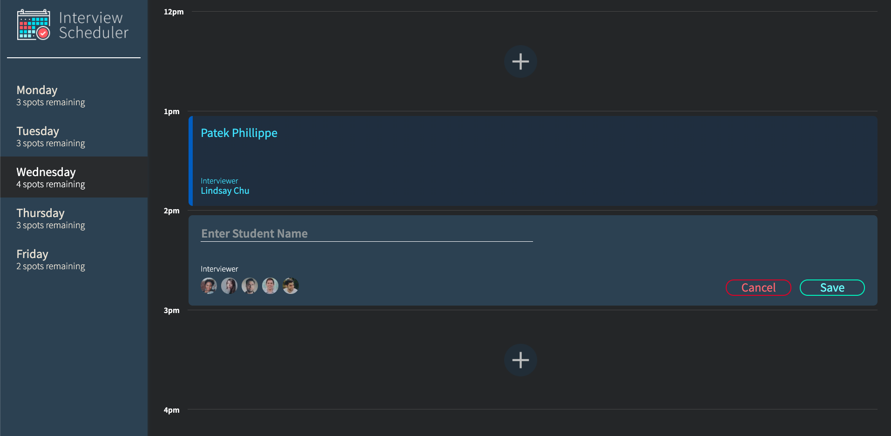

# Interview Scheduler

Interview scheduler is a React application that allows users to book and canel interviews.



## Dependencies

- Axios
- Classnames
- Normalize.css
- React
- React-DOM
- React-hooks-testing-library
- React-scripts

## Setup

Install dependencies with `npm install`.

## Running Webpack Development Server

```sh
npm start
```

## Running Jest Test Framework

```sh
npm test
```

## Running Storybook Visual Testbed

```sh
npm run storybook
```
